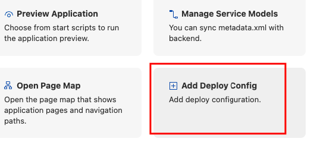

# Приклад перетворення SAPUI5 застосунку з HTML-Rep в SaaS  
Для перетворення звичайного SAPUI5 застосунку в SaaS необхідно виконати наступні кроки:

0. Виконати Undeploy звичайного SAPUI5 застосунку.
1. Перестворити mta.yaml файл.
2. Створити модул approuter.
3. Змінити xs-app.json файл. 
4. Добавити необхідні сервіси та налаштування в mta.yaml.
5. Виконати налаштування для Work Zone.

## 1. Перестворення mta.yaml

1.1. Робимо копію існуючого проекту (рекомендація).

1.2. Видаляємо існуючий mta.yaml.

1.3. Відкриваємо "Application Info" за допомогою контекстного меню по проекту та запускаємо Add Deploy Config.




1.3. Обираємо параметри, як показано на скріні.


> **Важливо**: Add application to managed application router необхідно виставити в No.

В результаті виконання попереднього пункту у нас сформувався новий mta.yaml. 

## 2. Створення модуля approuter.

2.1. На файлі mta.yaml відкриваємо контекстне меню та обираємо Create MTA Module from Template  


2.2. Обираємо шаблон Approuter Configuration, обираємо Standalone Approuter. 


2.3. На наступному кроці вибираємо "do not overwrite"


## 3. Змінюємо xs-app.json файл. 

3.1. Необхідно змінити метод аунтифікації та прописати роути, як показано в коді нижче

./sapbtphelloworldui5-approuter/xs-app.json
```properties
{
  "authenticationMethod": "route",
  "routes": [
    {
      "source": "^(?:/app|/app/.*)?/resources/(.*)$",
      "target": "/resources/$1",
      "authenticationType": "none",
      "destination": "ui5"
    },
    {
      "source": "^(?:/app|/app/.*)?/test-resources/(.*)$",
      "target": "/test-resources/$1",
      "authenticationType": "none",
      "destination": "ui5"
    }
  ],
  "welcomeFile": "/sapbtphelloworldui5"
}
```
> **Важливо**: В проекті є два файли `xs-app.json`. Правимо той, який знаходиться в папці роута (в прикладі це sapbtphelloworldui5-approuter)

## 4. Добавляємо необхідні сервіси та налаштування в mta.yaml.

> **Важливо**: В файлі `mta.yaml` використовується назва проєкту в назвах сервісів та модулів. В нашому прикладі - це `sapbtphelloworldui5`. Якщо назва проєкту інша, то потрібно використовувати саме її.

4.1. Налаштовуємо модуль типу `approuter.nodejs`

```properties
- name: sapbtphelloworldui5-approuter
  type: approuter.nodejs
  path: sapbtphelloworldui5-approuter
  requires:
  - name: sapbtphelloworldui5_html_repo_runtime
  - name: sapbtphelloworldui5_uaa
  - name: sapbtphelloworldui5-destination-service
    group: destinations
    properties:
      forwardAuthToken: true
      name: ui5
      url: https://ui5.sap.com
  - name: sapbtphelloworldui5-connectivity
  - name: saas-registry
  parameters:
    routes:
      - route: https://${subdomain}-${appname}.${default-domain}
      - route: https://${customer_subdomain}-${appname}.${default-domain}
    disk-quota: 256M
    memory: 256M
  properties:    
    TENANT_HOST_PATTERN: "^(.*)-${appname}.${default-domain}"
```
4.2. Модуль типу `com.sap.application.content` залишаємо без змін.
```properties
- name: sapbtphelloworldui5-app-content
  type: com.sap.application.content
  path: .
  requires:
  - name: sapbtphelloworldui5-repo-host
    parameters:
      content-target: true
  build-parameters:
    build-result: resources
    requires:
    - artifacts:
      - sapbtphelloworldui5.zip
      name: sapbtphelloworldui5
      target-path: resources/
```
4.3. Модуль типу `html5` залишаємо без змін.
```properties
- name: sapbtphelloworldui5
  type: html5
  path: .
  build-parameters:
    build-result: dist
    builder: custom
    commands:
    - npm install
    - npm run build:cf
    supported-platforms: []
```
4.4. Зайві модулі видаляємо. Наприклад, модуль типу `com.sap.application.content`

4.5. Переходимо до налаштувань ресурсів. Перший ресурс має назву `uaa_sapbtphelloworldui5`. Його варто перейменувати в `sapbtphelloworldui5_uaa` та налаштувати наступним чином.
```properties
- name: sapbtphelloworldui5_uaa
  type: org.cloudfoundry.managed-service
  parameters:    
    config:
      tenant-mode: shared
      xsappname: ${appname}
      oauth2-configuration: 
        redirect-uris: [https://*.cfapps.us10-001.hana.ondemand.com/**]
      scopes:
        - name: $XSAPPNAME.Read
          description: Read permission
        - name: $XSAPPNAME.Write
          description: Write permission
        - name: $XSAPPNAME.Callback
          description: With this scope set, the callbacks for tenant onboarding, offboarding and getDependencies can be called.
          grant-as-authority-to-apps:
            - $XSAPPNAME(application,sap-provisioning,tenant-onboarding)
      foreign-scope-references:
        - uaa.user
      role-templates:
        - name: Reader
          description: Can read
          scope-references:
            - $XSAPPNAME.Read
        - name: Author
          description: Can read and write
          scope-references:
            - $XSAPPNAME.Read
            - $XSAPPNAME.Write      
    service: xsuaa
    service-plan: application  
```
4.6. Ресурси з назвою `sapbtphelloworldui5_html_repo_runtime`, `sapbtphelloworldui5-destination-service` та `sapbtphelloworldui5-repo-host` лишаємо без змін.

4.7. Добавляємо ресурс з назвою `sapbtphelloworldui5-connectivity`
```properties
- name: sapbtphelloworldui5-connectivity
  type: org.cloudfoundry.managed-service
  parameters:
    service: connectivity
    service-plan: lite
```
4.8.  Добавляємо ресурс з назвою `saas-registry`
```properties
- name: saas-registry
  type: org.cloudfoundry.managed-service
  parameters:
    service: saas-registry
    service-plan: application
    service-name: ${appname}-saas-registry
    config:
      xsappname: ${appname}
      appName: ${appname}
      displayName: Hello World
      description: SaaS Hello World
      category: Custom KPI Apps
      appUrls:
        onSubscription: https://${subdomain}-${appname}.${default-domain}/callback/v1.0/tenants/{tenantId}        
        getDependencies: https://${subdomain}-${appname}.${default-domain}/callback/v1.0/dependencies
```
4.9. Добавляємо параметри, які використовуються в налаштуваннях модулів та ресурсів
```properties
  appname: sapbtphelloworldui5  
  subdomain: 574e1e10trial
  customer_subdomain: saas-customer-k0l6j388
```
> **Важливо**: Значення параметрів є індивідуальними для окремих проєктів.

4.10. Добавляємо `build-parameters` в кінець файлу
```properties
build-parameters:
  before-all:
  - builder: custom
    commands:
    - npm install
```

Кінцева версія файлу `mta.yaml` повинна виглядати приблизно
[так](helloworldui5_saas/mta.yaml)

## 5. Налаштування для Work Zone

Інформація взята з [блогу](https://community.sap.com/t5/technology-blogs-by-members/integrate-app-into-work-zone-from-a-different-subaccount/ba-p/13584425).

5.1. Вносимо зміни в файл index.html. В розділ Head добавляємо код перед скриптом з `id="sap-ui-bootstrap"`
```properties
<script> 
    window["sap-ui-config"] = { 
        allowlistService: '/allowlist/service', 
        frameOptions: 'trusted', 
        frameOptionsConfig: { 
            callback: function (bSuccess) { 
	        if (bSuccess) { 
	            console.log("App is allowed to run!"); 
	        } else { 
	            console.error("App is not allowed to run!"); 
	        } 
            } 
        } 
    }; 
</script>
```

5.2. Змінюємо файл `xs-app.json`, який знаходиться в папці approuter (в нашому прикладі це `sapbtphelloworldui5-approuter`). 
Після параметру
```properties
"welcomeFile": "/sapbtphelloworldui5"
```
добавляємо
```properties
"whitelistService": {
    "endpoint": "/allowlist/service"
  }
```
5.3. Змінюємо файл `mta.yaml`. В модулі типу `approuter.nodejs` в розділ `properties` добавляємо до існуючих параметрів наступні
```properties
CJ_PROTECT_WHITELIST: '[{"protocol": "https","host":"*.ondemand.com"}]'
httpHeaders: '[{"Content-Security-Policy":"frame-ancestors https://*.ondemand.com;"},{"X-Frame-Options":"SAMEORIGIN"},{"Cache-control":"no-cache, no-store, must-revalidate"}]'
```

Ці параметри необхідні не тільки для Work Zone, а і для відключення кешування.

5.4. В субакаунті, в якому є підписка на SaaS, в розділі `Security->Settings` добавляємо маску `https://*.ondemand.com` як трастовий домен.


5.5. В Work Zone створюємо аплікацію з зовнішнім посиланням. 

В результаті плитка має відкритися як нативний для Work Zone застосунок (iFrame).
